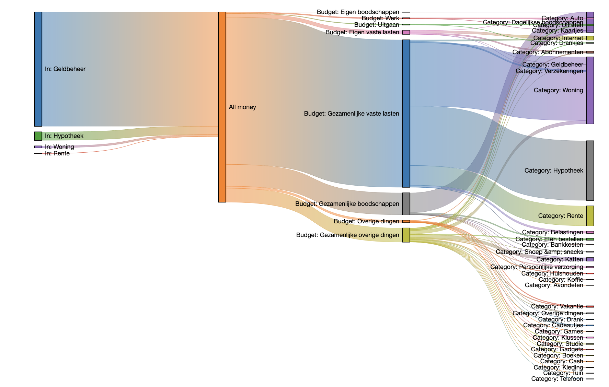

# Firefly III Sankey Diagram generator

## Introduction

A sankey diagram is a diagram that shows you the flow of things. In this case, money! Here's an example. The categories and budget labels are Dutch, sorry about that. Feel free to submit a better example!

## Generate your own diagram

This tool uses the [Firefly III](https://www.firefly-iii.org/) [API](https://api-docs.firefly-iii.org/) to generate such a diagram for you. You can tune it by excluding accounts, budgets and categories. Optionally, you can generate a diagram that includes all destination accounts (but this gets messy very quickly).

You can download and install the tool yourself or use the **[online version](https://sankey.firefly-iii.org/)**.

There is no Docker image and no installation instructions, I just built this tool for the fun of it.

## Support the development of Firefly III

If you like Firefly III and if it helps you save lots of money, why not send me a dime for every dollar saved! :tada:

OK that was a joke. If you feel Firefly III made your life better, consider contributing as a sponsor. Please check out my [Patreon](https://www.patreon.com/jc5) and [GitHub Sponsors](https://github.com/sponsors/JC5) page for more information. Thank you for considering donating to Firefly III!

## License

This work [is licensed](https://github.com/firefly-iii/firefly-iii/blob/main/LICENSE) under the [GNU Affero General Public License v3](https://www.gnu.org/licenses/agpl-3.0.html).

## Contact

You can contact me at [james@firefly-iii.org](mailto:james@firefly-iii.org), you may open an issue or contact me through the support channels:

- [GitHub Discussions for questions and support](https://github.com/firefly-iii/firefly-iii/discussions/)
- [Gitter.im for a good chat and a quick answer](https://gitter.im/firefly-iii/firefly-iii)
- [GitHub Issues for bugs and issues](https://github.com/firefly-iii/firefly-iii/issues)
- [Follow me around for news and updates on Twitter](https://twitter.com/Firefly_iii)

## Disclaimer

This tool works by downloading and parsing all your deposits and withdrawals. This happens entirely offline and no individual transactions are saved or cached. Running it yourself is very safe. 

But if you use the [online version](https://sankey.firefly-iii.org/) you have to be very sure you trust me with your data. I could be totally lying, the server could be hacked, etc. etc. I'm not responsible for anything that happens to your data. You have been warned.
